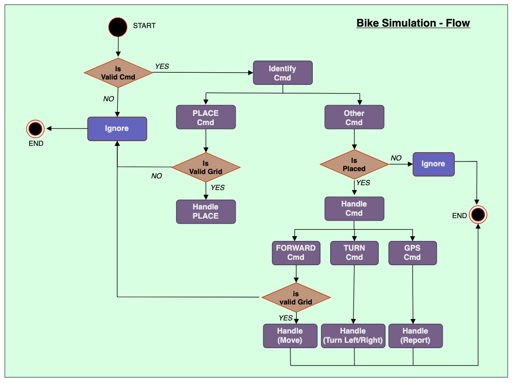
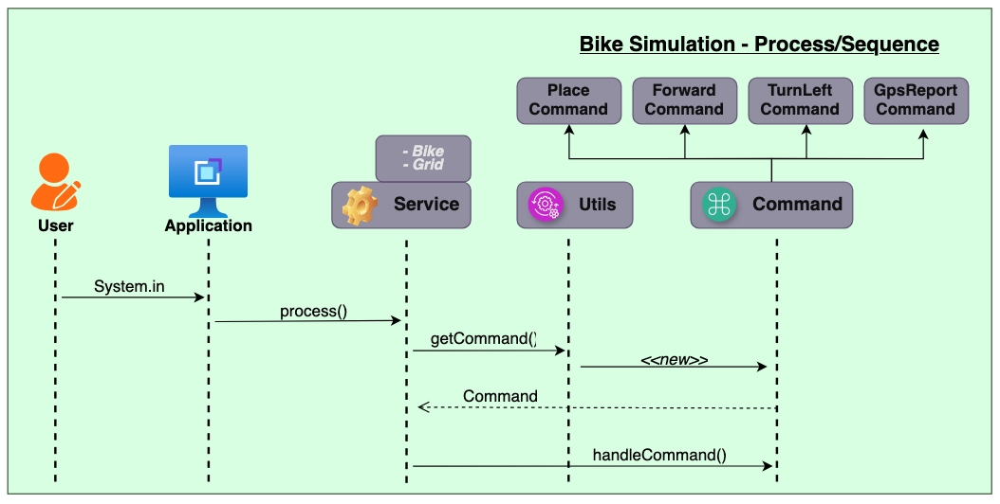

# Bike Simulator Application
This application simulates a bike driving on a 7 x 7 grid, where the position and direction of movements can be specified via a set of commands.
The user can request the current position of the bike at any given point in time.

## How to use
The following commands are supported by the application:
1. **PLACE x,y,<Facing-direction>** - 'Facing-direction' values could be NORTH, SOUTH, EAST or WEST, where
   (0,0) is the south-west corner.
2. **FORWARD** - will move the bike one unit forward in the direction it is currently facing.
3. **TURN_LEFT** - will rotate the bike to the left direction without
   changing its position on the grid.
4. **TURN_RIGHT** - will rotate the bike to the right direction without
   changing its position on the grid.
5. **GPS_REPORT** - will output the bike's position and the direction it's facing in the following format:
   (X,Y), <Facing-direction>

*NOTES:*
* The bike is free to move around the grid but must be prevented from exiting the grid.
Any movement that would cause the bike to leave the grid must be prevented,
however further valid movement must still be allowed.
* The application should discard all commands until a valid PLACE command has been
  executed. The application should also ignore all invalid commands.
* After the initial PLACE command any sequence of commands may be issued (and in any
  order) including another PLACE command.
* The bike must not exit the grid during movement. This includes the PLACE command.
  Any move that would cause the bike to leave the grid must be ignored.

## Logical Flow
The diagram below depicts the logical flow of the program w.r.t the commands received.


## Process
This is a sequence diagram of the implementation.


## Design and approach
Can be found here [here](src/main/resources/BikeSimulator_designApproach.pdf)

## How to run the application
_This project requires Java 17 to compile and run. <br>
Please make sure that Java 17 (JDK 17) is installed and properly configured in your system's environment variables (e.g., JAVA_HOME)._

* **Checkout** the project
```
git clone git@github.com:ruchirad/bike_simulation.git
```

* **Compile** the project
```
javac -d target/classes -sourcepath src/main/java $(find src/main/java -name "*.java")
```

* **Run** the project
```
java -cp target/classes com.bgl.bikesimulator.BikeSimulatorApplication
```

* Run with **debug** mode (debug=<i>true</i> | <i>false</i>)
```
java -Dbikesimulator.debug=true -cp target/classes com.bgl.bikesimulator.BikeSimulatorApplication
```

* Run commands through a **file**
```
java -cp target/classes com.bgl.bikesimulator.BikeSimulatorApplication src/test/java/resources/sample.txt
```

## How to run the test classes
* Compile test classes
```
javac -cp "target/classes:lib/*" -d target/test -sourcepath src/test/java $(find src/test/java -name "*.java")
```
* Run all tests
```
java -cp "target/classes:target/test:lib/*" org.junit.platform.console.ConsoleLauncher --scan-classpath
```
* Run specific test class
```
java -cp "target/classes:target/test:lib/*" org.junit.platform.console.ConsoleLauncher --select-class com.bgl.bikesimulator.service.BikeSimulatorServiceTest
```